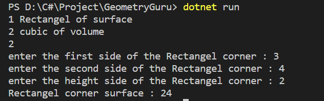

# GeometryGuru
turt determines the face of the corner

Have a look at *`Program.cs`* file and you can see hoe I have used: 

* Console input/output
* calculates cubic meters
* Arithmetic operations

## Demo 

this Switch operation

##

